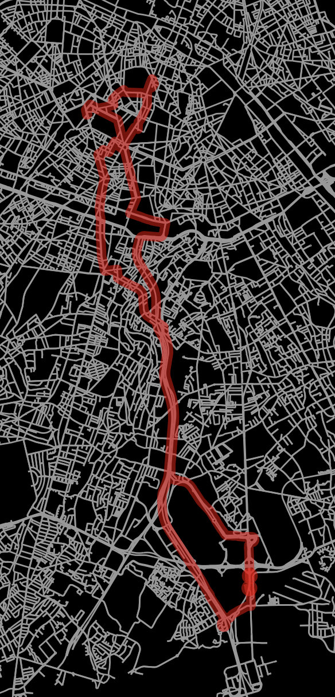

# hackathon-ap Simulation de tournées de distribution de marchandises et optimisation du parcours pour minimiser la distance ou bien la consommation d'énérgie

## Objectif

L'objectif de ce projet est de simuler des tournées de distribution de marchandises et d'optimiser le parcours pour minimiser la distance ou bien la consommation d'énérgie.

## Minimisation de la distance

### Récupération des données géographiques et création d'un graphe adapté

Pour minimiser la distance, nous avons besoin de données géographiques. Nous avons utilisé les données de l'API OpenStreetMap pour récupérer les données géographiques des villes et des routes. Nous avons ensuite créé un graphe orienté pondéré où les noeuds représentent les sites dont il est question et les arcs représentent les routes. Les poids des arcs représentent les distances entre les villes.

Ce programme est présent dans le fichier `create_graph_osdm.py`.

### Application de l'algorithme TSP pour minimiser la distance

Nous avons utilisé l'algorithme TSP (Travelling Salesman Problem) pour minimiser la distance. Cet algorithme est un problème d'optimisation consistant à déterminer le plus court chemin reliant un ensemble de villes et revenant à la ville de départ. Nous avons utilisé l'algorithme de Held-Karp pour résoudre ce problème.

Ce programme est présent dans le fichier `TSP_path.py`.

Il donne le résultat suivant :

## Minimisation de la consommation d'énergie

### Création d'un modèle de consommation d'énergie

Pour minimiser la consommation d'énergie, nous avons besoin de données sur la consommation d'énergie des véhicules. Nous avons créé un modèle simple qui donne une estimation de la consommation d'énergie en fonction de la distance parcourue sans arrêt. Ce calcul prend en compte le fait que si le vehicule s'arrête souvent, il consommera plus d'énergie.

Ce programme est présent dans le fichier `energy.py`.

### Application de l'algorithme TSP pour minimiser la consommation d'énergie

Il suffit d'appliquer l'algorithme TSP en utilisant le modèle de consommation d'énergie pour minimiser la consommation d'énergie.

Ce programme est présent dans le fichier `TSP_energy.py`.

Les résultats sont les suivants :

## Conclusion

On remarque que lorsque l'on cherche à minimiser la consommation d'énergie, le parcours est différent de celui qui minimise la distance. En effet, le parcours qui minimise la consommation d'énergie prend en compte le fait que le véhicule consomme plus d'énergie lorsqu'il s'arrête souvent. Ainsi, le parcours qui minimise la consommation d'énergie est plus direct et comporte moins d'arrêts que le parcours qui minimise la distance.

